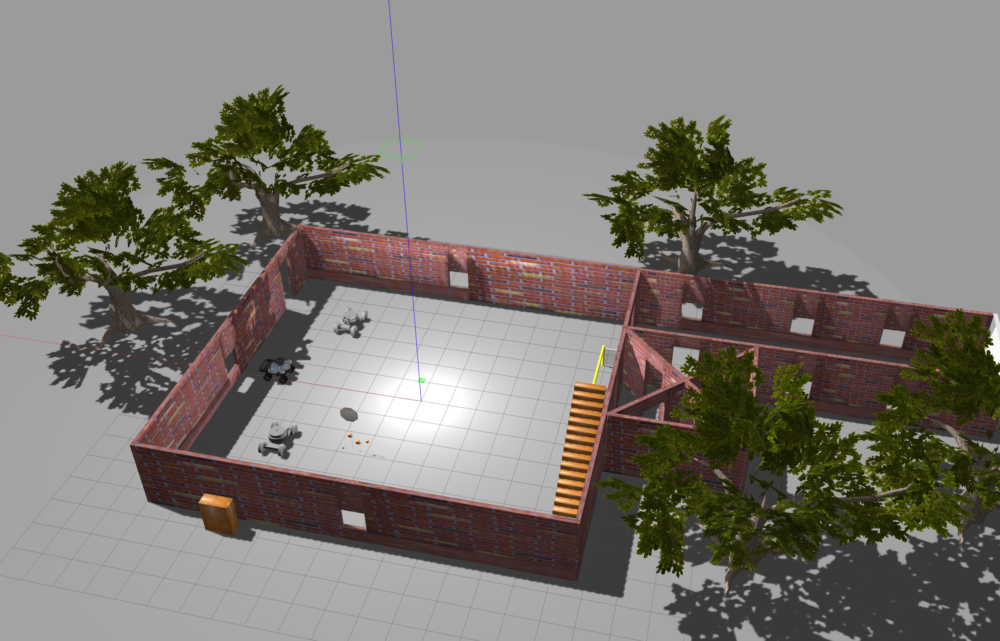
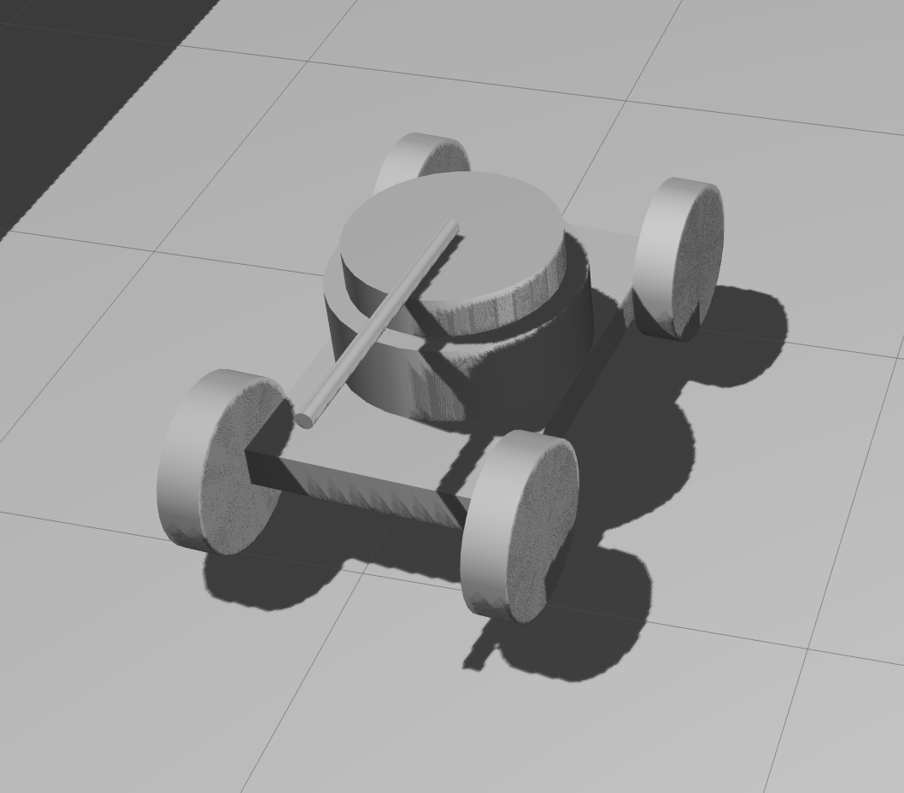
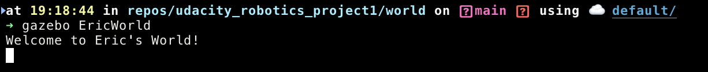

# Udacity Robotics Software Engineer - Gazebo
This first project contains a simple world containing a brick building, a few bookshelves, and fun additional items in the navigation environment.

The two primary robot models are simple toy tank chassis with small turrets.

## Screenshots

Below are some screenshots of the project.







## Building the Plugin
To build the plugin, please do the following (assuming MacOS):
```
cd ./build
cmake ../
make
```
The above code will output a `libwelcome.dylib` if on MacOS, or `libwelcome.so` on Ubuntu.

If using Ubuntu, please edit the `EricWorld` file inside `./world` to reflect the `.so` file instead of the `.dylib`.

